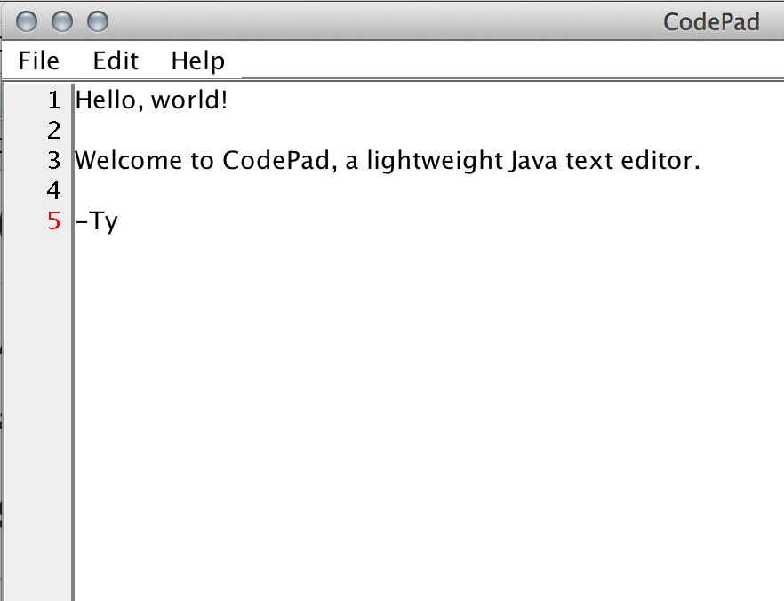

#CodePad
####_A Simple Text Editor for Programmers_
_2014 Ty-Lucas Kelley_

###Screenshot

	
**LICENSE (GPLv3)**

	This file is a part of CodePad.

	CodePad is free software: you can redistribute it and/or modify it under the terms of the GNU General Public License as published by the Free Software Foundation, either version 3 of the License, or (at your option) any later version. 
	
    CodePad is distributed in the hope that it will be useful, but WITHOUT ANY WARRANTY; without even the implied warranty of MERCHANTABILITY or FITNESS FOR A PARTICULAR PURPOSE. See the GNU General Public License for more details.

    You should have received a copy of the GNU General Public License along with CodePad. If not, see http://www.gnu.org/licenses/.

###What is it?
A simple, Java-based, multi-platform text editor. It is lightweight, but includes several useful features:

1. Ability to edit files
2. Line numbers that add with each new line and disappear when lines are deleted.
3. Cut, Copy, Paste
4. Time and Date
5. An "About" section
6. New, Open, Save, Save As
7. Undo and Redo
8. Hitting tab adds four spaces instead of eight (important for Python, etc.)
9. Link to webpage for updates
10. Printing text files

###How do I run it?

1. Go to https://github.com/tylucaskelley/CodePad
2. Click "Download ZIP"
3. Double-click the "CodePad.jar" file to run!
